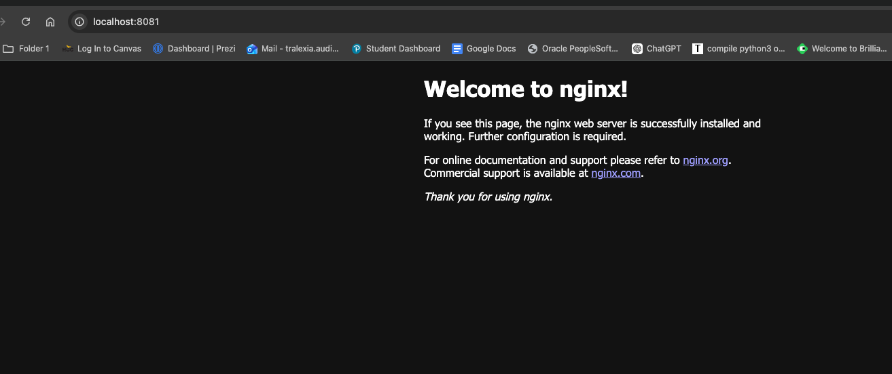
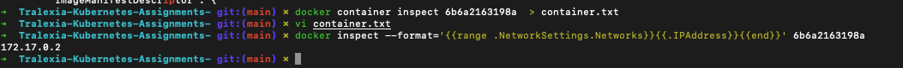

Assignment 01

## Part 1.  Reflection

- A command that was new for me was the 'docker container exec' command. I used it to go in a running container and run commands directly.
 It helped me understand how containers work from the inside. I also used it to check the environment variables and edit files within the container.

## Part 2. Answers 

- Images vs Containers: An image is like a template or blueprint, while a container is a running instance of that image.
- run vs exec: `docker run` creates and starts a new container, while `docker exec` runs a command inside an already running container.
- Read-only mount flag: The flag is `--mount` with `readonly` or `ro`, which allows files to be mounted without being changed.
## Part 3. Evidence

# Tralexia-Kubernetes-Assignments-

## Part 4. 

One thing that surprised me about Docker is how isolated containers are from each other and from my computer. Even though everything is running on the same machine, each container acts like its own separate environment with its own files and settings. I didn’t realize that changes inside a container don’t affect anything outside of it unless you specifically set that up. That made me understand why Docker is so useful for keeping environments consistent

