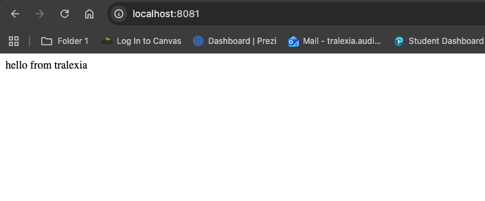

Assignment 01

## Part 1.  Reflection

- A command that was new for me was the 'docker container exec' command. I used it to go in a running container and run commands directly.
 It helped me understand how containers work from the inside. I also used it to check the environment variables and edit files within the container.

## Part 2. Answers 

- Images vs Containers: An image is like a template or blueprint, while a container is a running instance of that image.
- run vs exec: `docker run` creates and starts a new container, while `docker exec` runs a command inside an already running container.
- Read-only mount flag: The flag is `--mount` with `readonly` or `ro`, which allows files to be mounted without being changed.
## Part 3. Evidence

# Tralexia-Kubernetes-Assignments-

